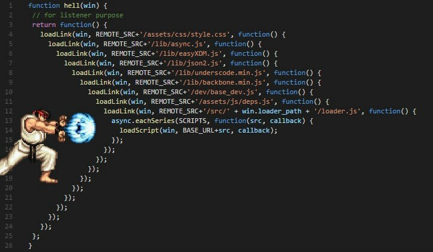

# Mục lục
[1. Callback](#1-callback)

[2. Promise](#2-promise---có-từ-es6)

[3. JQuery Ajax](#3-jquery-ajax)

[4. XML](#4-xml)

[5. Regex](#5-regex)

[6. Restful API ](#6-restful-api)

[7. JWT](#7-jwt)

[8. Phân biệt Authentication và Authorization](#8-phân-biệt-authentication-và-authorization)

[9. SPA và MPA](#9-spa-và-mpa)

[10. SSR và CSR](#10-ssr-và-csr)

[11. Lazy loading](#11-lazy-loading)

[12. Mô hình MVC](#12-mô-hình-mvc)

[13. Mô hình MVP](#13-mô-hình-mvp)

[14. Mô hình MVVM](#14-mô-hình-mvvm)

## <span style="color: #ffab24">**1. Callback**</span>
Là hàm được truyền qua đối số khi gọi hàm khác và được gọi lại trong hàm nhận đối số
```javascript
function myFunc(param){
		param('Hello');
	}
	
function myCallBack(value){
console.log('Value', value)
}
	
myFunc(myCallBack);  --> Hello
```
	   
	   
## <span style="color: #ffab24">**2. Promise** - Có từ ES6</span>     
	   
- **sync** : đồng bộ --> thằng nào viết trước thì chạy trước
	
	VD:
	``` javascript
	console.log(1)	
	console.log(2)
	--> In ra 1 trước và 2 sau	
	```
	
			
- async: bất đồng bộ (setTimeout, setInterval, fetch, xml, file reading, req animation)
	```javascript
	setTimeout(function(){
		console.log(1);
	,1000});
	console.log(2);
	--> In 2 trước và 1 sau
	```
==> Và để chúng ta biết các thao tác trên khi nào xong
thì JS cung cấp cho chúng ta Callback để xử lý.
- Tuy nhiên nó sẽ xảy ra vấn đề --> Promise sinh ra để xử lý điều này

### <span style="color: #34f7ee">**Promise (pain)**</span> 	   
- ### **Callback Hell**
	

	--> Các dữ liệu ràng buộc với nhau sinh ra callback hell

### <span style="color: #34f7ee">**Promise (concept)**</span> 	   
```javascript
var promise = new Promise(	// Promise: Object Constructor
	// Executor
	function(resolve, reject){
		// Logic
		// Success --> gọi resolve() và thất bại --> reject()
	})  

promise
	.then(function(){})  // Được gọi khi resolve() được gọi
	.catch(function(){}) // Được gọi khi reject() được gọi
	.finally(function(){}) // Đều được gọi 
```
3 trạng thái của promise:
- Pendding: Trạng thái chờ thành công hay thất bại --> nếu chạy hoài thì bị memory leak
- Fulfilled: Trạng thái thành công
- Rejected: Trạng thái thất bại

Tính chất chuỗi
``` javascript
promise
	.then(function(data){
			return 1;
		})  
	.then(function(data){	// data: 1 (nhận từ hàm 1)
			console.log(data);
			return 2;
		}) 
	.then(function(data){	// data: 2 (nhận từ hàm 2)
			console.log(data);
			return 3;
		}) 
	.catch(function(){}) // Được gọi khi reject() được gọi
	.finally(function(){}) // Đều được gọi 
```
	   
## <span style="color: #ffab24">**3. JQuery Ajax**</span>     
- AJAX - "Asynchronous JavaScript and XML" - là một bộ công cụ cho phép load dữ liệu từ server mà không yêu cầu tải lại trang. Nó sử dụng chức năng sẵn có XMLHttpRequest(XHR) của trình duyệt để thực hiện một yêu cầu đến server và xử lý dữ liệu server trả về. 
- jQuery cung cấp method **$.ajax** và một số methods tiện lợi giúp bạn làm việc với XHRs thông qua trình duyệt một cách dễ dàng hơn.

	- a) Phương thức “load()”
		- Cú pháp:
		```javascript
		[selector].load( URL, [data], [callback] );
		```
		- Ví dụ:
		```javascript
		$(document).ready(function() {
            $("#driver").click(function(event){
                $('#stage').load('./result.html');
            });
		});

		<div id="stage">STAGE</div>
        <input type="button" id="driver" value="Load Data" />
		```
		--> Hàm load() khởi tạo một AJAX request tới URL file đã xác định là ./result.html. Sau khi tải file này, tất cả nội dung sẽ được đưa đến vào trong phần tử được tag với ID là stage.

	- b) Phương thức “get()” và “post()”
		- get()
		```javascript
		$(document).ready(function() {
			$('#load-du-lieu').click(function(e) {
				e.preventDefault();
				$.get('vidu1.html', function(ketqua) {
					$('#noidung').html(ketqua);
					$('#noidung').html($('#chuoi-can-lay').html());
				});
				
			});
		});
		```

		- post()
		```javascript
		$(document).ready(function() {
			$('#load-du-lieu').click(function(e) {
				e.preventDefault();
				$.post('vidu2.php', {
					a: "content abc",
					b: "content bcd"
				},function(ketqua) {
					$('#noidung').html(ketqua);
				});
				
			});
    	});
		```
	- c) Phương thức “ajax()”
	```javascript
	$(document).ready(function() {
		$('#load-du-lieu').click(function(e) {
			e.preventDefault();
			$.ajax({
				url: 'vidu2.php',
				type: 'POST',
				dataType: 'html',
				data: {
					a: "content abc",
					b: "content bcd"
				}
			}).done(function(ketqua) {
				$('#noidung').html(ketqua);
			});
			
		});
	});
	```
	Đối số đầu tiên chúng ta truyền vào cho phương thức “ ajax() ” chính là một đối tượng (Object) gồm các thuộc tính cấu hình để kĩ thuật AJAX của chúng ta có thể thực thi. Trong đó:

	- **url** : chuỗi chứa đường dẫn tới file cần lấy và trả về dữ liệu
	- **type** : phương thức gửi đi tương tự như của `<form>`, mặc định là “GET” nếu như các bạn không truyền vào.
	- **dataType** : xác định dữ liệu trả về thuộc dạng nào? Nếu các bạn không truyền thì jQuery tự động nhận biết kiểu dữ liệu (script, html, json…). Tuy nhiên, tôi khuyến cáo các bạn nên truyền vào đầy đủ để nhận dữ liệu chính xác nhất. Và thông dụng nhất chính là “html”.
	- **data** : truyền dữ liệu sang đường dẫn chỉ định để thực hiện xử lý và trả về dữ liệu. Tương tự như cách truyền dữ liệu của phương thức “ post() ”.
	- **“done()”** : ở loạt các bài viết hướng dẫn các bài viết về kĩ thuật Ajax với phương thức “ ajax() ” trước đây trên Internet. Thay vì dùng “done()” chúng ta sẽ dùng thuộc tính “success” trong đối tượng truyền vào “ ajax() ” nhưng từ các phiên bản mới hơn của jQuery. Họ khuyến cáo chúng ta nên sử dụng các phương thức như “ done() , fail() , always() ” (Tương ứng: Hoàn thành, thất bại và luôn luôn thực hiện). Nên tùy vào nhu cầu mà bạn xài phương thức tương ứng. Và nên nhớ là đi kèm với phương thức “ ajax() ” hoặc lưu vào một tên biến rồi dùng sau để nhận kết quả trả về.

## <span style="color: #ffab24">**4. XML**</span> 
- Trong lập trình ứng dụng web, XML được sử dụng nhiều nhất là xây dựng các API Service. Các API sẽ trả kết quả về dạng XML hoặc JSON để các hệ thống khác có thể nói nói chuyện với nhau được. Hiện nay tuy JSON được sử dụng phổ biến hơn, nhưng XML cũng vẫn đang được dùng bởi nhiều hệ thống lớn.

- XML là gì?
	- XML là từ viết tắt của từ Extensible Markup Language là ngôn ngữ đánh dấu mở rộng. XML có chức năng truyền dữ liệu và mô tả nhiều loại dữ liệu khác nhau. Tác dụng chính của XML là đơn giản hóa việc chia sẻ dữ liệu giữa các nền tảng và các hệ thống được kết nối thông qua mạng Internet.

	- XML dùng để cấu trúc, lưu trữ và trong trao đổi dữ liệu giữa các ứng dụng và lưu trữ dữ liệu. Ví dụ khi ta xây dựng một ứng dụng bằng Php và một ứng dụng bằng Java thì hai ngôn ngữ này không thể hiểu nhau, vì vậy ta sẽ sử dụng XML để trao đổi dữ liệu. Chính vì vậy, XML có tác dụng rất lớn trong việc chia sẻ, trao đổi dữ liệu giữa các hệ thống.


## <span style="color: #ffab24">**5. Regex**</span> 


Ví dụ
- Phương thức exec được dùng để tìm chuỗi phù hợp theo mẫu so khớp.
	```javascript
	var myRe = /d(b+)d/g;
	var myArray = myRe.exec("cdbbdbsbz");

	hoặc
	
	var myArray = /d(b+)d/g.exec("cdbbdbsbz");
	```
- Nếu bạn muốn khởi tạo một biểu thức chính quy từ một chuỗi:
	```javascript
	var myRe = new RegExp("d(b+)d", "g");
	var myArray = myRe.exec("cdbbdbsbz");
	```

## <span style="color: #ffab24">**6. Restful API**</span> 
### <span style="color: #34f7ee">**6.1 Restful API**</span> 
- RESTful API là một tiêu chuẩn dùng trong việc thiết kế API cho các ứng dụng web (thiết kế Web services) để tiện cho việc quản lý các resource
### <span style="color: #34f7ee">**6.2 Các thành phần**</span> 
- **API** (Application Programming Interface) là một tập hợp các quy tắc và cơ chế cho phép các ứng dụng hoặc thành phần khác tương tác với nhau. API có thể trả về dữ liệu dạng JSON hoặc XML để ứng dụng của bạn sử dụng.
- **REST** (REpresentational State Transfer) là một kiểu kiến trúc API sử dụng phương thức HTTP để giao tiếp giữa các máy tính. Thay vì sử dụng URL để xử lý thông tin người dùng, REST sử dụng các yêu cầu HTTP như GET, POST, DELETE để thao tác dữ liệu.

- **Chức năng quan trọng nhất** của REST là quy định cách sử dụng các HTTP method (như GET, POST, PUT, DELETE…) và cách định dạng các URL cho ứng dụng web để quản các resource. RESTful không quy định logic code ứng dụng và không giới hạn bởi ngôn ngữ lập trình ứng dụng, bất kỳ ngôn ngữ hoặc framework nào cũng có thể sử dụng để thiết kế một RESTful API.

### <span style="color: #34f7ee">**6.3 Hoạt động**</span> 
REST hoạt động chủ yếu dựa vào giao thức HTTP. Các hoạt động cơ bản nêu trên sẽ sử dụng những phương thức HTTP riêng.
- GET (SELECT): Trả về một Resource hoặc một danh sách Resource.
- POST (CREATE): Tạo mới một Resource.
- PUT (UPDATE): Cập nhật thông tin cho Resource.
- PATCH (tương tự PUT):  Được dùng để thay đổi data, nhưng nó chỉ thay đổi những field được yêu cầu thay đổi thay vì toàn bộ resource.
- DELETE (DELETE): Xoá một Resource.


### <span style="color: #34f7ee">**6.4 Authentication và dữ liệu trả về**</span> 
RESTful API không sử dụng session và cookie, nó sử dụng một access_token với mỗi request. Dữ liệu trả về thường có cấu trúc như sau:
```json
{
    "data" : {
        "id": "1",
        "name": "TopDev"
    }
}
```

### <span style="color: #34f7ee">**6.5 Status code**</span> 
- 2xx - Thành công
	- 200	- Trả về thành công cho các method
- 3xx - Điều hướng lại hoặc ko thay đổi
	- 304 - Not Modified – Client có thể sử dụng dữ liệu cache.
- 4xx - lỗi client
	- 400 - Request không hợp lệ
	- 404 - Not Found 
- 5xx - lỗi server

### <span style="color: #34f7ee">**6.6 Authorization**</span> 
Hiện tại có 3 cơ chế Authorize chính:
- HTTP Basic
- [JSON Web Token (JWT)](#1-callback)
- OAuth2

## <span style="color: #ffab24">**7. JWT**</span>
### <span style="color: #34f7ee">**7.1 Khái niệm**</span> 
JWT (JSON Web Token) là một phương tiện đại diện cho các yêu cầu chuyển giao giữa hai bên Client – Server , các thông tin trong chuỗi JWT được định dạng bằng JSON. 


### <span style="color: #34f7ee">**7.2 Cấu trúc**</span> 

Gồm 3 phần, được ngăn cách nhau bởi dấu chấm (.):
#### <span style="color: #f0ec18">**a. Header**</span> 
- Phần header sẽ chứa kiểu dữ liệu , và thuật toán sử dụng để mã hóa ra chuỗi JWT
```json
{
	"typ": "JWT",
	"alg": "HS256"
}
```
- **“typ” (type)** chỉ ra rằng đối tượng là một **JWT**
- **“alg” (algorithm)** xác định thuật toán mã hóa cho chuỗi là **HS256**

#### <span style="color: #f0ec18">**b. Payload**</span> 
Phần payload sẽ chứa các thông tin mình muốn đặt trong chuỗi  Token như username , userId , author , … ví dụ:
```json
{
  "user_name": "admin",
  "user_id": "1513717410",
  "authorities": "ADMIN_USER",
  "jti": "474cb37f-2c9c-44e4-8f5c-1ea5e4cc4d18"
}
```
#### <span style="color: #f0ec18">**c. Signature**</span> 
Phần chử ký này sẽ được tạo ra bằng cách mã hóa phần header , payload kèm theo một chuỗi secret (khóa bí mật) , ví dụ:
```javascript 
data = base64urlEncode( header ) + "." + base64urlEncode( payload )
signature = Hash( data, secret );
```
- **base64UrlEncoder** : thuật toán mã hóa header và payload

Đoạn code trên sau khi mã hóa header và payload bằng thuật toán base64UrlEncode ta sẽ có chuỗi như sau
```javascript
// header
eyJhbGciOiJIUzI1NiIsInR5cCI6IkpXVCJ9

// payload
eyJhdWQiOlsidGVzdGp3dHJlc291cmNlaWQiXSwidXNlcl9uYW1lIjoiYWRtaW4iLCJzY29wZSI6WyJyZWFkIiwid3JpdGUiXSwiZXhwIjoxNTEzNzE
```
Sau đó mã hóa 2 chuỗi trên kèm theo secret (khóa bí mật) bằng thuật toán HS256 ta sẽ có chuỗi signature như sau:
```jwt
9nRhBWiRoryc8fV5xRpTmw9iyJ6EM7WTGTjvCM1e36Q
```
### <span style="color: #34f7ee">**7.3 Khi nào nên dùng JWT**</span> 
- Authentication: Đây là trường hợp phổ biến nhất thường sử dụng JWT. Khi người dùng đã đăng nhập vào hệ thống thì những request tiếp theo từ phía người dùng sẽ chứa thêm mã JWT. Điều này cho phép người dùng được cấp quyền truy cập vào các url, service, và resource mà mã Token đó cho phép. Phương pháp này không bị ảnh hưởng bởi Cross-Origin Resource Sharing (CORS) do nó không sử dụng cookie.

- Trao đổi thông tin: JSON Web Token là 1 cách thức khá hay để truyền thông tin an toàn giữa các thành viên với nhau, nhờ vào phần signature của nó. Phía người nhận có thể biết được người gửi là ai thông qua phần signature. Và chữ ký được tạo ra bằng việc kết hợp cả phần header, payload lại nên thông qua đó ta có thể xác nhận được chữ ký có bị giả mạo hay không.

## <span style="color: #ffab24">**8. Phân biệt Authentication và Authorization**</span> 
- Authentication (xác thực người dùng) 
- Authorization (các quyền của người dùng)


### <span style="color: #34f7ee">**8.1 Các phương thức phổ biến dùng authentication**</span> 
#### <span style="color: #f0ec18">**a. Basic Authentication**</span> 
- Đây là phương thức xác thực **ít được khuyến khích** bởi tình bảo mật của nó không an toàn. 
- Dễ thực hiện
- Người gửi (sender) sẽ gửi username, password của mình trong *header* của request. Username và password phải được mã hóa dưới dạng Base64 để đảm bảo tính an toàn hơn.
- Với phương thức này *có thể không cần yêu cầu* về cookies, session ID... bởi vì chỉ cần sử dụng với http header, không cần đến hỗ trợ từ response khác.
	```javascript
	Authorization: Basic bG9sOnNlY3VyZQ==
	```
#### <span style="color: #f0ec18">**b. Bearer Authentication**</span> 
- Còn được gọi là token authentication
- Có thể hiểu đơn giản là "cấp quyền truy cập cho người mang (bearer) token này". 
- Bearer token sẽ cho phép truy cập đến một số tài nguyên hoặc url nhất định và thường là một chuỗi string được mã hóa, được sinh ra bởi server trong response để thực hiện request login.
- Khi thực hiện bằng phương thức này thì client phải gửi bearer token này trong header để thực hiện request
	```javascript
	Authorization: Bearer <token>
	```
**- Quá trình:**
1. User gửi request -> server để lấy một token bằng username, password thông qua SSL, server sẽ trả về một chuỗi access token. 
2. Access token này chính là bearer token mà client cần phải gửi vào header nếu muốn thực hiện các request khác để server xác thực user đó là đúng. 
	- Token này có thể là một chuỗi mã hóa với các thuộc tính của user, vai trò của user đó. 
	- Khi server nhận được token này, sẽ giải mã sau đó sẽ thực hiện validate request đó trong ứng dụng xem user có được quyền thực hiện request đó hay không. 
	- Token này thường sẽ có hạn (ví dụ: 30 phút sau khi lấy sẽ hết hạn) bởi vì có thể role của user sẽ thay đổi trong quá trình thực hiện. Sẽ có trường hợp ví dụ user đang có role="Admin" chuyển thành "User". 
	- Nếu token không hết hạn thì token cũ với role="Admin" vẫn có quyền truy cập với role đó mặc dù đã bị thay đổi.

#### <span style="color: #f0ec18">**c. Api Keys**</span> 	
-  Được tạo ra để khắc phục những vấn đề của basic authentication. 
- Trong phương thức này, một giá trị key duy nhất sinh (unique key) ra và gán cho user trong lần đầu tiên, biểu thị rằng user đó được xác định. 
- Khi user quay trở lại hệ thống, unique key được sử dụng để chứng minh rằng user là giống với lần đầu tiên.

#### <span style="color: #f0ec18">**d. OAuth (2.0)** - Open với Authentication hoặc Authorization</span> 	
- Ra đời nhằm giải quyết các vấn đề trên và xa hơn nữa, đây là một phương thức chứng thực giúp các ứng dụng có thể chia sẻ tài nguyên với nhau mà không cần chia sẻ thông tin username và password. - OAuth bao gồm bốn vai trò khác nhau:
	- **Resource Server**: REST API là một ví dụ, một máy chủ HTTP nơi người dùng có thể tạo, sửa đổi hoặc xóa các bản ghi, tài liệu hoặc tệp.

	- **Resource Owner**: 
		- Duy trì *quyền sở hữu tài nguyên* mà người dùng đã tạo hoặc sửa đổi trên máy chủ
		- *Quyền truy cập hạn chế* của bên thứ 3 vào tài khoản của người dùng, dựa trên phạm vi của phạm vi của ủy quyền được cấp.

	- **Client**: 
		- Ứng dụng bên thứ 3 muốn truy cập vào tài khoản người dùng. <br>
		--> Bắt buộc máy chủ resource/authorization và chủ sở hữu tài nguyên phải **ủy quyền** cho yêu cầu đó. 
		- Mọi khách hàng phải được đăng ký với máy chủ authorization và sẽ được cung cấp thông tin xác thực duy nhất của riêng mình (client_id và client_secret).

	- **Authorization Server** (thường là giống Resource Server): Đôi khi, ta có thể muốn rút ra khỏi máy chủ authorization từ máy chủ resource và triển khai nó như một phiên bản chuyên dụng, đặc biệt là trong các môi trường phân tán.

	- **Ví dụ:**<br>
		- Khi ta đăng nhập bằng Facebook hay Gmail, website sẽ dẫn ta đến trang (hoặc phần mềm) Facebook và liệt kê những quyền mà nó cần phải có để cho phép bạn đăng nhập và sử dụng dịch vụ. 
		- Nếu ta *đồng ý* thì lúc này Facebook sẽ phát cho website một cái token(chứa một số quyền hạn nhất định giúp cho website có thể xác minh chúng ta là ai cũng như giúp cho website có thể hoạt động được). 
		- Nếu website này bị hacker tấn công thì nó chỉ lấy được thông tin hay hoạt động của ta trên website đó mà không ảnh hưởng đến những website khác đang sử dụng. 
	
	`--> Do đó cách đăng nhập bằng phương thức OAuth này rất an toàn cho người dùng cuối như chúng ta.
`


## <span style="color: #ffab24">**9. SPA và MPA**</span> 

### <span style="color: #34f7ee">**9.1 SPA - Single-Page Application**</span> 
- ReactJS là 1 trong những thư viện tạo ra SPA 
- Các "ông lớn" sử dụng SPA : Google, Facebook, Twitter 
- Các SPA khác : F8, Shoppe, 30shine, chotot, zingmp3
- Single-Page đang nói đến kiến trúc phía bên dưới,	chứ không phải là Web 1 trang dưới mắt nhìn người dùng

### <span style="color: #34f7ee">**9.2 Cách triển khai**</span> 
- SPA - Single-Page Application -> CSR --> Client side rendering
- MPA - Multi-Page Application  -> SSR --> Server side rendering
	
### <span style="color: #34f7ee">**9.3 Sự khác biệt**</span> 
- SPA : 
	- Được cho là cách tiếp cận hiện đại hơn
	- Không yêu cầu tải lại trang trong quá trình sử dụng

- MPA:
	- Cổ điển
	- Tải lại trang trong QT sử dụng (click vô đường link, chuyển sang,...)
	- Thường dùng php, nodejs,...
	
### <span style="color: #34f7ee">**9.4 So sánh**</span>  
- Tốc độ 
	- SPA nhanh hơn khi sử dụng 
		- Phần lớn tài nguyên được tải trong lần đầu (Có thể chậm hơn lần đầu)
		- Trang chỉ tải thêm dữ liệu mới khi cần 
	- MPA chậm hơn khi sử dụng 
		- Luôn tải lại toàn bộ trang khi truy cập và chuyển hướng 
			
- Bóc tách 
	- SPA có phần Front-end riêng biệt 
	- MPA Front-end & Back-end phụ thuộc nhau nhiều hơn, được đặt trong cùng 1 dự án 
	- Mô hình MVC (controller, views,...)
	
- SEO (Search Engine Optimization - Tối ưu hóa công cụ tìm kiếm)
	- SPA không thân thiện với SEO như MPA 
	- Trải nghiệm trên thiết bị di động tốt hơn 

- UX (User Experience)
	- SPA cho trải nghiệm tốt hơn, nhất là các theo tác chuyển trang 
	- Trải nghiệm trên thiết bị di động tốt hơn 

- Quá trình phát triển 
	- SPA dễ dàng tái sử dụng code (component) 
	- SPA bóc tách FE & BE 
		- Chia team phát triển song song 
		- Phát triển thêm mobile app dễ dàng 14

## <span style="color: #ffab24">**10. SSR và CSR**</span> 
### <span style="color: #34f7ee">**10.1 SSR (server side render):**</span> 
- Request các API để trả về từ server -> Sau đó trình duyệt render ra
- Ưu điểm:
	- tốt cho seo, tăng thứ hạng cho website (dantri, tintuc,...)
	- Request đầu tiên đa phần sẽ nhanh hơn
	- Phát triển ứng dụng nhanh hơn SSR (các ứng dụng nhỏ)
		
- Khuyết điểm:
	- Reload cả trang khi chuyển hướng
		
### <span style="color: #34f7ee">**10.2 CSR (Client side render):**</span> 
- Vẫn có 1 chút SSR (render thẻ div trống `<main>`)
- Bên client sẽ đọc các file js rồi render ra (trình duyệt phải bật chức năng js, nếu tắt đi --> die)
- Như Reactjs (chuyển trang ko cần load lại full trang)
	
- Ưu điểm:
	- Chuyển trang mượt mà (ko cần reload cả trang) 
		
- Khuyết yếu: 
	- Request đầu tiên sẽ chậm hơn
	- Không đọc được nội dung trang tin tức, ko mang tính seo (các trang thời sự, tin tức sẽ ko dùng CSR)

## <span style="color: #ffab24">**11. Lazy loading**</span> 
### <span style="color: #34f7ee">**11.1 Khái niệm**</span> 
- Là 1 kĩ thuật tối ưu khi làm web, thay vì tải toàn bộ trang web và render ngay từ đầu, kỹ thuật này cho phép tải ngay các thành phần cần thiết để hiển thị tới người dùng và trì hoãn các tài nguyên còn lại cho đến khi cần.
- Ưu điểm: Tối ưu hiệu suất web, đỡ tốn tài nguyên, băng thông,...

### <span style="color: #34f7ee">**11.2 Ứng dụng**</span> 
- Được sử dụng rộng rãi nhất trong lập trình, thiết kế website. 
- WordPress cung cấp một giải pháp dựa trên Lazy Loading mang tên Infinite Scroll, hỗ trợ bạn sử dụng con lăn và cuộn con chuột liên tục để đọc thêm các nội dung mới.
- Google tiếp cận với Lazy loading theo hướng cụ thể là ở mục tìm kiếm hình ảnh. Google sẽ đưa ra danh sách 4-5 bức ảnh liên quan sau khi xem cụ thể một tấm hình nào đó và bên cạnh đó là nút “View More” để xem nhiều ảnh hơn.

### <span style="color: #34f7ee">**11.3 Các kỹ thuật cơ bản**</span> 
-  Thêm thuộc tính loading với giá trị lazy:
	```html
	
	```
	- Dưới đây là các giá trị được hỗ trợ cho thuộc loading:
		- **auto**: Giá trị mặc định phụ thuộc vào hành vi của từng trình duyệt, tương tự với việc không thêm thuộc tính loading vào.
		- **lazy**: Trì hoãn tải tài nguyên về cho đến khi đạt 1 khoảng cách nào đó từ khung nhìn.
		- **eager**: Tải tài nguyên ngay lập tức, bất kể vị trí của nó trên trang.

	- Đối với các trình duyệt chưa hỗ trợ thì có thể tạo polyfill hoặc dùng thư viện bên thứ 3 như [LazySizes](https://github.com/aFarkas/lazysizes)

- ### [LazySizes](https://github.com/aFarkas/lazysizes)
	- Là thư viện có tốc độ cao, tối ưu SEO và tự khởi tạo (self-initializing) cho mục đích lazy load ảnh (bao gồm cả ảnh đáp ứng picture / srcset), iframe, script / widget và nhiều thành phần khác nữa. 
	- Nó cũng ưu tiên các tài nguyên dựa trên sự khác biệt về tầm mức quan trọng, trong đó. LazySizes ưu tiên các phần tử nằm trong khung nhìn và gần khung nhìn trình duyệt (near view elements) để tối ưu tốc độ tải nhận thức (perceived performance) nhanh hơn.


## <span style="color: #ffab24">**12. Mô hình MVC**</span> 
## <span style="color: #ffab24">**13. Mô hình MVP**</span> 
## <span style="color: #ffab24">**14. Mô hình MVVM**</span> 
## <span style="color: #ffab24">**15. Local Storage, Session Storage và Cookie**</span> 

## <span style="color: #ffab24">**16. Khác biệt giữa HTML và HTML5**</span> 
HTML5 là phiên bản mới nhất của HTML và cung cấp nhiều tính năng mới như hỗ trợ multimedia, semantic elements, canvas, drag and drop, và offline storage.
## <span style="color: #ffab24">**17. Một số cách tăng Performance website**</span> 
Để tối ưu hóa hiệu suất Front-end có thể sử dụng các kỹ thuật như:  
- minification và compression của file CSS và JavaScript
- lazy loading, caching, sử dụng sprites hình ảnh, tối ưu hóa đường dẫn và kích thước hình ảnh, và loại bỏ các tài nguyên không cần thiết.
## <span style="color: #ffab24">**18. Tiêu chuẩn W3C**</span> 
## <span style="color: #ffab24">**19. HTTP Request Và HTTP Response**</span> 
## <span style="color: #ffab24">**20. So sánh Javascript ES5 và ES6**</span> 
### <span style="color: #34f7ee">**Giống nhau**</span> 
- Cả ES5 và ES6 đều là phiên bản của JavaScript và chạy trên các trình duyệt hiện đại.
- Cả hai phiên bản hỗ trợ việc xử lý các loại dữ liệu cơ bản, như chuỗi, số, mảng, đối tượng, hàm, và điều khiển luồng.
### <span style="color: #34f7ee">**Khác nhau**</span> 
## <span style="color: #ffab24">**14. Mô hình MVVM**</span> 
## <span style="color: #ffab24">**14. Mô hình MVVM**</span> 
## <span style="color: #ffab24">**14. Mô hình MVVM**</span> 
## <span style="color: #ffab24">**14. Mô hình MVVM**</span> 
## <span style="color: #ffab24">**14. Mô hình MVVM**</span> 
## <span style="color: #ffab24">**14. Mô hình MVVM**</span> 


Express: môi trường

Nodemon: Thao tác nhanh hơn, tự động cập nhật trang

Morgan: Phần mềm trung gian, giúp chúng ta log http request ra terminal cho chúng ta biết 

interface và type, asyn, await, ES5, ES6,...
implement APi 
API, storage, các cách bảo mật website và phòng trnhas
nguyenquocduythuan@gmail.com